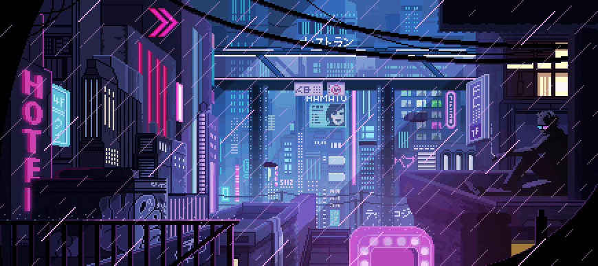

  
       
  
            
                               

                        
        
### I'm Jayvie De Leon, Jev for short and nice to meet you!  Junior Full-Stack Developer   For Frontend: NextJS, TailwindCSS, NextUI  For Backend: Python, Django

I do IoT programming mainly in Raspberry Pi but also have knowledge in using Arduino.. 
  
I also do 3D modeling/designing using Blender...
   
- 🔭 I’m currently working on 2 projects Inventory and Money Tracker https://jtd-inventory-management-system.vercel.app/, https://jtd-moneytracker.vercel.app/ **currently prioritizing inventory**
- 📖 I’m currently expanding my knowledge in Django, NextJs...
- 👯 I’m currently employed in Geopro Global Solution...    
- 💬 I do Internet of Things projects...  
- ⚡ Hobby: Play Genshin and Guitar... 
  

<h3>Languages and Tools:</h3>

<h3>Connect with Me:</h3>
  
  &nbsp;   &nbsp;   &nbsp; <a href="mailto:jayvief.deleon@gmail.com"> 

  

  

  

  
